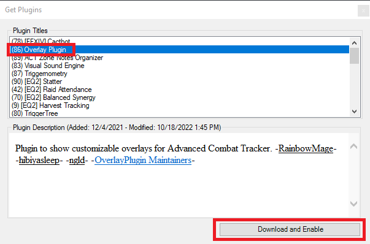
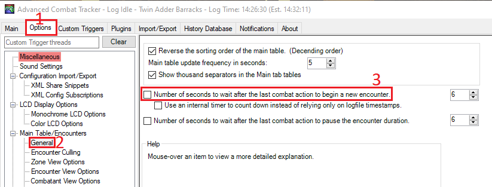
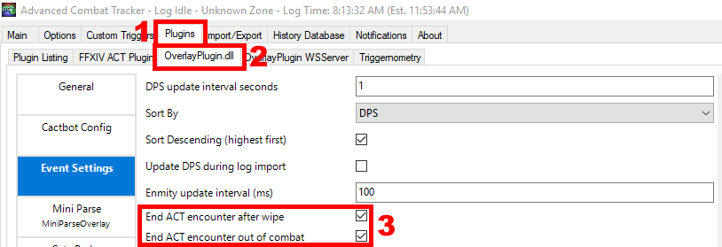

# FFXIV ACT Setup Guide

This guide is intended to get a FFXIV player setup with ACT and an overlay for parsing purposes and be able to upload logs to the FFLogs website.

*Last updated: 2024-09-02*

## Contents
- [Installing ACT](#installing-act)
- [FFXIV ACT Plugin](#ffxiv-act-plugin)
  - [Configuring FFXIV ACT Plugin](#configuring-ffxiv-act-plugin)
- [OverlayPlugin](#overlayplugin)
  - [Using OverlayPlugin to End Encounters](#using-overlayplugin-to-end-encounters)
- [Adding an Overlay](#adding-an-overlay)
  - [Preset Overlays](#preset-overlays)
  - [Custom Overlays](#custom-overlays)
- [FFLogs Uploader](#fflogs-uploader)
  - [Installing the Uploader](#installing-the-uploader)
  - [Uploading a Log](#uploading-a-log)

## Installing ACT

Navigate to the [ACT website](https://advancedcombattracker.com/), click on the **Download** page tab, then click on the `Advanced Combat Tracker - Setup` link to download the ACT installation program.

Find the `ACTv3-Setup` executable in your downloads and run it to begin the installation (If you get a User Account Control prompt, click yes).

The setup program will ask you for the installation location and start menu folder (You can leave the default options). Click **Install** then **Close** to complete the installation.

## FFXIV ACT Plugin

Upon first running ACT, it will prompt you with the Startup Wizard. If you forget to download a parsing plugin, ACT will prompt you again the next time you run it, or you can manually open the wizard by going to **Options** > **Miscellaneous** > **Show Startup Wizard**.

In the **Parsing Plugin** section of the startup wizard, ensure `FFXIV Parsing Plugin` is selected from the dropdown, then click the `Download/Enable Plugin` button. You will receive an alert when the plugin has been added to ACT. Click **Ok** to dismiss it.

Click **Next** to move to the log file section. ACT will ask if it will be used for Final Fantasy XIV. Select **Yes** to configure ACT logs for FFXIV.

Click **Next** to move to Startup Settings, then **Close** to accept the default settings and finish the startup wizard.

At this point `FFXIV_ACT_Plugin.dll` should be enabled in **Plugins** > **Plugin Listing**.

### Configuring FFXIV ACT Plugin

Previously, there were options to use other methods to capture network data, but as of patch 7.2 the only remaining option is Deucalion. Everything is included in the default plugin install, and no additional configuration steps are required.

##### Running as Admin
Most users will no longer need to run ACT as Admin. If you need to do so for some reason, you'll need to run FFXIV as Admin as well.

##### Adding Firewall Exception
Due to Deucalion being the only valid option as of patch 7.2, firewall exceptions are no longer needed.

## OverlayPlugin

From the **Plugin Listing** tab, click on the `Get Plugins...` button near the upper right corner. This will open a window that will populate with available plugins for ACT.

In the **Get Plugins** window, select the `Overlay Plugin` option and click on `Download and Enable`. This will add the latest **OverlayPlugin** to ACT (the OverlayPlugin auto-updater may also run during this step). 

The OverlayPlugin should now be setup. Click on the `X` to close the **Get Plugins** window.

**At this point it is recommended to restart ACT before continuing on.**

### Using OverlayPlugin to End Encounters

It is recommended to use OverlayPlugin's in/out-of-combat detection to split encounters, rather than ACT's less accurate behavior.

To do this, first find ACT's encounter split timeout (Options > Main Table/Encounters > General).
It is recommended to disable it entirely by un-checking both `Number of seconds to wait` checkboxes:

Then, under Plugins > OverlayPlugin.dll tab > Event Settings, enable "End ACT encounter after wipe" and "End ACT encounter out of combat":

## Adding an Overlay

### Preset Overlays

OverlayPlugin comes with built-in presets for a majority of popular overlays. To setup an overlay go to **Plugins** > **OverlayPlugin.dll** and click on the `New` button. 

This will open the **Create new overlay** dialog. Enter a **name** for the overlay and select a **preset** from the dropdown (the overlayplugin will show you a preview of each preset). Once you have selected your desired overlay, click on the **OK** button to add your overlay.

Your overlay should now appear in the overlays list. Select it from the list to view and edit its settings. You can move your overlay to the desired position, then check the **Lock overlay** box to lock it in place.

You can add additional overlays using the same steps. Certain plugins, e.g. cactbot plugin, will populate the preset dropdown with additional presets for their respective overlays.

### Custom Overlays

For an overlay not available in the presets, select the **Custom** option from the dropdown and the desired **Type**. For most overlays, it will be the **MiniParse** type.

In the overlay settings, make sure to add the overlay **URL** source. It can be a web url or the path to a local html file.

## FFLogs Uploader

### Installing the Uploader

Navigate to the [FFLogs Download](https://www.fflogs.com/client/download/) page and download the FFLogs client application for your platform. 

Find the `FFLogsUploader` install application in your downloads and run it. The application will ask you whether to install for all users or just yourself. Click on the **Install** button after selecting your choice then **Finish** once the installation is done.

### Uploading a Log

*Note: You will need to [register](https://www.fflogs.com/register/) for an FFLogs account in order to upload logs.*

Run the FFlogs Uploader application. Enter the account information you used to sign up. Once you are authenticated, click on the **Upload a Log** button.

Click on **Choose** to select the log to upload.

In the File Explorer, navigate to the folder where the log is saved. The default location is at `%APPDATA%\Advanced Combat Tracker\FFXIVLogs`. You can copy and paste that path in the explorer bar to go directly to the default folder.

In the log folder, selected the desired log to upload, and click on **Open**. To ensure the latest log is on top, you can sort by **Date modified**.

Choose the desired access level for the log: **Public**, **Private**, or **Unlisted**. Public will be ranked and Private and Unlisted are un-ranked. Anyone will be able to view a Public log. Private logs can only be viewed by you. Unlisted logs can be viewed by anyone with the link to the log.

If you want to upload only a specific encounter, toggle the **Select Specific Raids To Upload** option, then click on the **Go!** button.

Select the specific encounter you want to upload from the list and click on the **Go!** button. You may select multiple encounters by holding *`Ctrl`* on your keyboard. 

*Note: this view is only available if you selected specific raids to upload.*

Once the uploader is finished uploading the encounters to the FFLogs website, click on **View Report** to open up the page in your default browser and view the log results.

